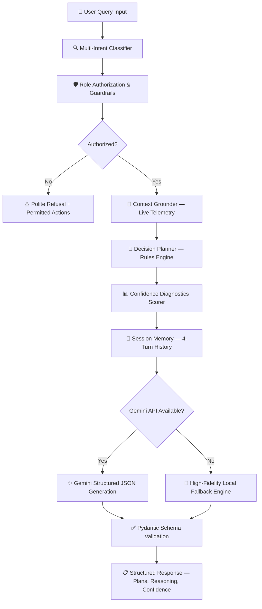
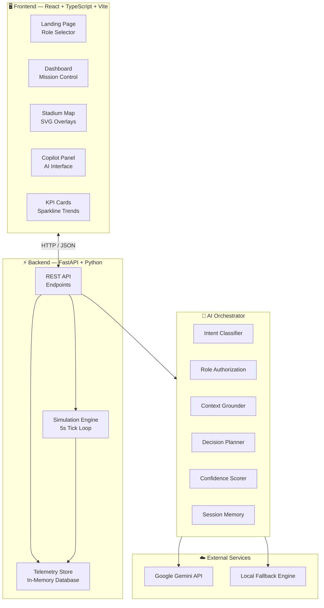

<div align="center">

# 🏟️ MatchOps AI

### AI-Powered Smart Stadium Mission Control Platform

*Real-time operations intelligence for the world's largest sporting events*

<br />

[](https://react.dev)
[](https://fastapi.tiangolo.com)
[](https://www.typescriptlang.org)
[](https://ai.google.dev)
[](https://tailwindcss.com)
[](https://python.org)
[](LICENSE)

<br />

[**🚀 Live Demo →**](https://matchops-ai.onrender.com)

<br />

MatchOps AI is an enterprise-grade, GenAI-powered operations command center designed to manage live stadium operations during high-stakes events like the **FIFA World Cup 2026**, **Olympic Games**, **Super Bowl**, and **UEFA Champions League**. It combines real-time crowd telemetry, multi-stage AI reasoning, incident management, and role-based situational awareness into a single Mission Control interface — giving operators the confidence to make split-second decisions that protect 85,000+ spectators.

<br />

---

</div>

## 📋 Executive Summary

### The Problem

Managing a live stadium event with 85,000+ spectators requires coordinating dozens of operational streams simultaneously — crowd flow, security, medical response, transport, concessions, sustainability, and emergency planning. Traditional dashboards display raw data but offer **no decision support**, leaving operators to interpret complex signals under extreme time pressure.

### The Solution

MatchOps AI transforms raw stadium telemetry into **actionable, AI-grounded recommendations** through a multi-stage reasoning pipeline. Every query passes through intent classification, role authorization, context grounding, decision planning, and confidence scoring before generating structured recommendations — complete with explainability timelines and multi-step action plans.

### What Makes It Different

| Traditional Dashboard | MatchOps AI |
|:---|:---|
| Displays raw metrics | Interprets data and **recommends actions** |
| One-size-fits-all view | **Role-specific workspaces** for Fans, Volunteers, Security, Organizers |
| No AI reasoning | **Multi-stage AI pipeline** with explainability and confidence scoring |
| Static data | **Live simulation engine** with 5-second telemetry ticks |
| English only | **Multilingual AI** — English, Spanish, French, Arabic, Portuguese |
| No incident workflow | **Full incident lifecycle** — report, triage, dispatch, resolve |

<br />

---

## 🎯 Key Highlights

<table>
<tr>
<td width="50%">

### 🧠 AI Decision Intelligence
Multi-stage orchestrator with intent classification, role-based guardrails, context grounding, confidence scoring, and session memory — powered by Google Gemini with automatic local fallback.

</td>
<td width="50%">

### 📡 Real-Time Simulation
Deterministic operations simulator models MetLife Stadium with 5-second telemetry ticks — crowd density, queue wait times, transport delays, sustainability metrics, and emergency scenarios.

</td>
</tr>
<tr>
<td width="50%">

### 🛡️ Role-Based Workspaces
Four specialized dashboards (Fan, Volunteer, Security, Organizer) with permission-scoped AI access, tailored KPIs, and role-appropriate feature sets.

</td>
<td width="50%">

### 🗺️ Interactive Stadium Map
SVG-rendered stadium with 7 overlay layers — Crowd Density, Gate Status, Security Zones, Medical Posts, Parking, Evacuation Routes, and AI Watch Highlights.

</td>
</tr>
<tr>
<td width="50%">

### ♿ Accessibility-First Design
High contrast mode, large text scaling, screen reader compatibility, wheelchair-accessible routing, and WCAG-informed color palette across all interfaces.

</td>
<td width="50%">

### 🌍 Multilingual Operations
AI Copilot generates reasoning summaries and recommendations in English, Spanish, French, Arabic, and Portuguese — adapting both UI labels and AI output.

</td>
</tr>
</table>

<br />

---

## 🚀 Live Demo

<div align="center">

### [**→ Launch MatchOps AI ←**](https://matchops-ai.onrender.com)

*No installation required. Explore all four role-based dashboards directly from your browser.*

</div>

> **Quick Start:** Select the **Organizer** role → Enter badge ID `ORG-2026` → Click **Access Workspace** to experience the full Mission Control dashboard with AI Copilot, Stadium Map overlays, real-time KPIs, and incident management.

| Role | Badge ID | What You'll See |
|:---|:---|:---|
| 🏆 **Fan** | *(none required)* | Navigation, transport, concessions, accessibility features |
| 🤝 **Volunteer** | `VOL-2026` | Crowd intelligence, incident reporting, zone allocation tools |
| 🛡️ **Security** | `SEC-2026` | Threat monitoring, emergency dispatch, security zone overlays |
| 🎯 **Organizer** | `ORG-2026` | Full Mission Control — all KPIs, AI Copilot, simulation controls |

<br />

---

## ✨ Core Features

### 🤖 AI Operations Copilot

The Gemini-powered Copilot is not a chatbot — it is a **structured decision support system**. Every response includes:

- **Primary Recommendation** with confidence score (0.0–1.0)
- **Reasoning Timeline** showing how the decision was reached
- **Multi-Step Action Plans** with chronological execution steps
- **Data Assumptions** listing which telemetry sources were consulted
- **Missing Information Disclosures** for transparent uncertainty communication

### 📊 Real-Time KPI Monitoring

Six executive-level KPI cards with sparkline trend indicators:
- **Live Attendance** — real-time headcount vs. 85,000 capacity
- **Venue Capacity** — percentage fill with color-coded thresholds
- **Avg Ingress Wait** — mean gate queue time across all entry points
- **Solar Offset** — live sustainability energy generation percentage
- **Active Incidents** — open incident count with severity breakdown
- **AI Confidence** — aggregate confidence score across recent AI queries

### 🗺️ Interactive Stadium Map

Seven switchable overlay layers rendered on an SVG stadium blueprint:

| Overlay | Intelligence Displayed |
|:---|:---|
| 🟢 Crowd Density | Gate congestion heatmap (green / amber / red) |
| 🚪 Gate Status | Real-time open/closed indicators per gate |
| 🔴 Security Zones | Active security perimeter fills with patrol rings |
| 🟡 Medical Posts | Positioned medical station markers with status |
| 🅿️ Parking | Lot capacity percentages with highlighted connectors |
| 🟠 Evac Routes | Animated evacuation path arrows to assembly points |
| 🟣 AI Highlights | Gemini-identified watch zones with pulsing indicators |

### 🚨 Incident Management

Full incident lifecycle from creation to resolution:
- Report incidents with location, zone, priority, and description
- Automatic staff allocation based on severity (Low: 1, Medium: 2, High: 4)
- Real-time status tracking (Active → Investigating → Resolved)
- Stadium map beacon updates on incident dispatch

### 🌤️ Weather & Emergency Intelligence

- **Weather Widget** — temperature, wind, humidity, rain probability, visibility, and operational impact assessment
- **Emergency Readiness Panel** — medical units, security teams, emergency vehicles, evacuation route status, and estimated response time

### 🚇 Transport Intelligence

Live tracking of multi-modal transport networks:
- Metro/rail departure schedules and delay propagation
- Shuttle bus frequencies and route status
- Rideshare wait time estimates and surge indicators
- Parking lot fill rates with recommended lot routing

### ♻️ Sustainability Dashboard

Real-time environmental metrics:
- Water consumption tracking against event targets
- Solar panel energy generation and grid offset percentages
- Waste diversion rates and landfill reduction progress

<br />

---

## 👥 Role-Based Experience

Each role sees a tailored workspace with permission-scoped AI access and appropriate feature depth:

| Capability | 🏆 Fan | 🤝 Volunteer | 🛡️ Security | 🎯 Organizer |
|:---|:---:|:---:|:---:|:---:|
| Navigation & Wayfinding | ✅ | ✅ | ✅ | ✅ |
| Accessibility Planning | ✅ | ✅ | ✅ | ✅ |
| Transport Intelligence | ✅ | — | ✅ | ✅ |
| Lost & Found | ✅ | ✅ | — | ✅ |
| Crowd Intelligence | — | ✅ | ✅ | ✅ |
| Crowd Risk Analysis | — | — | ✅ | ✅ |
| Incident Reporting | — | ✅ | ✅ | ✅ |
| Emergency Response | — | — | ✅ | ✅ |
| Volunteer Allocation | — | — | — | ✅ |
| Sustainability Metrics | — | — | — | ✅ |
| Organizer Summary | — | — | — | ✅ |
| Simulation Controls | — | — | — | ✅ |

> **Authorization Guardrails:** If a user queries beyond their role's clearance, the AI intercepts the request, returns a clear explanation of the restriction, and lists the actions they *are* permitted to take.

<br />

---

## 🧠 AI Decision Pipeline

Every query to the AI Copilot passes through a structured, multi-stage reasoning pipeline:



<details>
<summary><strong>Pipeline Stage Details</strong></summary>

| Stage | Component | Function |
|:---|:---|:---|
| 1 | **Multi-Intent Classifier** | Classifies queries into 12 intent categories. Supports compound multi-intent queries (e.g., *"Find Gate C and check shuttle schedules"*). |
| 2 | **Role Authorization** | Validates the query against the user's role permissions. Generates polite refusal responses for unauthorized intents. |
| 3 | **Context Grounder** | Assembles live sensor telemetry — matches, queue waits, restrooms, transit delays, sustainability offsets, staff shifts, and incident status. |
| 4 | **Decision Planner** | Applies operational rules — turnstile detours, concourse medical bypasses, accessibility ramp routing, and congestion-aware gate recommendations. |
| 5 | **Confidence Scorer** | Calculates a numerical confidence index (0.0–1.0) with explicit reasoning. Records data checklist omissions to prevent false certainty. |
| 6 | **Session Memory** | Ingests up to 4 historical message pairs per session to support contextual follow-up questions. |
| 7 | **Structured Output** | Gemini generates responses constrained to Pydantic models — ensuring valid recommendations, assumptions, checklists, and multi-step plans. |

</details>

<br />

---

## 🏗️ System Architecture



<br />

---

## 🛠️ Technology Stack

| Layer | Technology | Purpose |
|:---|:---|:---|
| **Frontend Framework** | React 19 | Component-based UI with hooks and memoization |
| **Type System** | TypeScript 6.0 | End-to-end type safety across all components |
| **Build Tool** | Vite 8.1 | Lightning-fast HMR and optimized production builds |
| **Styling** | Tailwind CSS 3.4 | Utility-first CSS with glassmorphism design system |
| **Icons** | Lucide React | Consistent, accessible icon library |
| **Charts** | Recharts | Sparkline trend visualizations in KPI cards |
| **Backend** | FastAPI 0.139 | High-performance async Python web framework |
| **Server** | Uvicorn | ASGI server with hot reload support |
| **Validation** | Pydantic 2.13 | Runtime data validation and schema enforcement |
| **AI Engine** | Google Gemini API | Structured JSON generation with safety filters |
| **Fallback AI** | Custom Orchestrator | High-fidelity local reasoning when Gemini is unavailable |
| **Containerization** | Docker | Multi-stage build (Node.js + Python) |
| **Linting** | oxlint | Fast, zero-config TypeScript/React linter |

<br />

---

## 📂 Project Structure

```
matchops-ai/
│
├── backend/
│   ├── ai/
│   │   └── orchestrator.py          # Multi-stage AI Orchestrator (921 lines)
│   │                                  Intent classification, role auth, context grounding,
│   │                                  decision planning, confidence scoring, session memory,
│   │                                  Gemini integration, and local fallback engine
│   ├── utils/
│   │   └── database.py              # In-memory simulation database
│   │                                  FIFA 2026 telemetry: matches, crowds, transport,
│   │                                  concessions, restrooms, sustainability, incidents
│   ├── models.py                    # Pydantic schemas — Incident, AIResponse,
│   │                                  ReasoningTimeline, AIRecommendation, MultiStepPlan
│   ├── main.py                      # FastAPI app — REST endpoints, CORS, simulation
│   │                                  tick loop, static SPA serving, health probe
│   └── tests/
│       └── test_orchestrator.py     # 9 unit tests — intents, permissions, sessions,
│                                      simulation phases, KPIs, confidence diagnostics
│
├── frontend/
│   ├── src/
│   │   ├── components/
│   │   │   ├── StadiumMap.tsx        # SVG stadium with 7-layer overlay system
│   │   │   ├── CopilotPanel.tsx      # AI chat interface with reasoning pipeline display
│   │   │   ├── Onboarding.tsx        # Role-specific interactive onboarding walkthrough
│   │   │   └── ui/
│   │   │       ├── MetricCard.tsx     # KPI card with sparkline trend chart
│   │   │       ├── GlassCard.tsx      # Glassmorphism container component
│   │   │       ├── StatusBadge.tsx    # Color-coded status indicator
│   │   │       ├── DataTable.tsx      # Sortable, searchable, paginated data table
│   │   │       ├── InsightCard.tsx    # Expandable AI insight card
│   │   │       ├── EventHeroBanner.tsx       # Live match context strip
│   │   │       ├── OpsTimeline.tsx           # Filterable operations timeline
│   │   │       ├── EmergencyReadiness.tsx    # Emergency response status widget
│   │   │       ├── WeatherIntelligence.tsx   # Weather and operational impact widget
│   │   │       └── GeminiOpsFeed.tsx         # AI insights feed with confidence bars
│   │   ├── pages/
│   │   │   ├── LandingPage.tsx       # Role selector and language configurator
│   │   │   └── Dashboard.tsx         # Main Mission Control orchestrator (1,114 lines)
│   │   ├── types/
│   │   │   └── index.ts             # Shared TypeScript interfaces
│   │   ├── App.tsx                   # Root — theme, accessibility, routing state
│   │   ├── index.css                 # Tailwind directives, glassmorphism tokens,
│   │   │                               GPU-accelerated animations, design system
│   │   └── main.tsx                  # React DOM entry point
│   ├── tailwind.config.js
│   ├── postcss.config.js
│   ├── index.html
│   └── package.json
│
├── Dockerfile                        # Multi-stage: Node.js build → Python serve
├── .dockerignore
├── .env.example
├── requirements.txt
├── LICENSE                           # MIT
└── README.md
```

<br />

---

## 🖥️ Running Locally

### Prerequisites

- **Node.js** v18 or higher
- **Python** 3.9 or higher

### 1. Clone the Repository

```bash
git clone https://github.com/tanush326k/matchops-ai.git
cd matchops-ai
```

### 2. Start the Backend (FastAPI)

```bash
# (Optional) Create and activate a virtual environment
python -m venv venv
source venv/bin/activate        # macOS/Linux
# .\venv\Scripts\activate       # Windows PowerShell

# Install dependencies
pip install -r requirements.txt

# (Optional) Set your Gemini API key
export GEMINI_API_KEY="your-api-key-here"    # macOS/Linux
# $env:GEMINI_API_KEY="your-api-key-here"    # Windows PowerShell

# Start the server
python -m uvicorn backend.main:app --reload --port 8000
```

> **Note:** If no `GEMINI_API_KEY` is provided, the backend automatically activates a high-fidelity local reasoning engine that produces identically structured responses. The application is fully functional without an API key.

Verify the health endpoint:
```bash
curl http://localhost:8000/api/health
```
```json
{
  "status": "ok",
  "version": "Final",
  "simulation": true,
  "gemini_available": true,
  "fallback_available": true,
  "timestamp": "2026-07-19T09:17:07Z"
}
```

### 3. Start the Frontend (React + Vite)

```bash
cd frontend
npm install
npm run dev
```

### 4. Open the Application

Navigate to **http://localhost:5173** in your browser.

<br />

---

## 🔐 Environment Variables

| Variable | Description | Required | Default Behavior |
|:---|:---|:---:|:---|
| `GEMINI_API_KEY` | Google Gemini API key for AI Copilot | Optional | Activates high-fidelity local fallback engine |
| `GOOGLE_API_KEY` | Alternative Gemini API key name | Optional | Same behavior as `GEMINI_API_KEY` |
| `PORT` | Backend server port | Optional | `8000` (local) · `8080` (Docker) |

<br />

---

## 🎬 Demo Scenarios

Use the **Scenario Control** toolbar (Organizer role) to trigger realistic operational conditions:

- [ ] **Pre-Match** → Baseline state, gates opening, early arrivals
- [ ] **Entry Rush** → Peak ingress, elevated queue times at all gates
- [ ] **Kickoff** → Match begins, concourse traffic drops, attention shifts to pitch
- [ ] **Halftime** → Concession wait times spike to 45 min, restroom queues peak
- [ ] **Full Time** → Match concludes, egress planning activates
- [ ] **Exit Rush** → Maximum outbound crowd flow, transport coordination critical
- [ ] **🚨 Emergency** → Medical and smoke hazard incidents trigger on Block 114 and Concourse 220
- [ ] **🏗️ Heavy Crowd** → Gate queues spike to peak congestion levels
- [ ] **🚇 Transit Delay** → 25-minute rail delays with rideshare surge pricing
- [ ] **♿ Accessibility Surge** → Wheelchair priority boarding queue loads increase

<br />

---

## 🧪 Testing

### Backend Unit Tests

```bash
# Run from the project root
python -m pytest backend/tests/ -v
```

```
tests/test_orchestrator.py::test_accessibility_routing_rules    PASSED
tests/test_orchestrator.py::test_confidence_diagnostics         PASSED
tests/test_orchestrator.py::test_multiple_intents               PASSED
tests/test_orchestrator.py::test_navigation_intent_analysis     PASSED
tests/test_orchestrator.py::test_proactive_insights             PASSED
tests/test_orchestrator.py::test_role_authorization_restriction PASSED
tests/test_orchestrator.py::test_session_memory                 PASSED
tests/test_orchestrator.py::test_simulation_engine_phases       PASSED
tests/test_orchestrator.py::test_simulation_kpis                PASSED
─────────────────────────────────────────────────────
9 passed
```

### Frontend Lint

```bash
cd frontend
npm run lint
```

```
Found 0 warnings and 0 errors.
Finished in 73ms on 21 files with 103 rules.
```

### Production Build

```bash
cd frontend
npm run build
```

```
✓ 2352 modules transformed
✓ built in 3.63s — 0 errors, 0 warnings
```

<br />

---

## 🔮 Future Roadmap

| Phase | Initiative | Description |
|:---:|:---|:---|
| 🔜 | **LLM Security Guardrails** | Integrate Google Cloud Armor and prompt injection filters at the API gateway layer to harden against adversarial queries. |
| 🔜 | **Predictive Crowd Analytics** | Build ARIMA/LSTM time-series models to anticipate gate congestion 30 minutes before arrival peaks. |
| 🔮 | **Multi-Stadium Federation** | Extend the data schema to support simultaneous simulation across MetLife, Azteca, and BC Place stadiums during tournament phases. |
| 🔮 | **Computer Vision Integration** | Process live CCTV feeds for automated crowd density estimation and anomaly detection using Google Cloud Vision AI. |
| 🔮 | **Mobile Command App** | Native iOS/Android companion app for field security teams with push-notification-driven incident dispatch. |

<br />

---

<div align="center">

**Built with ❤️ for the FIFA World Cup 2026**

*MatchOps AI — Where artificial intelligence meets stadium operations*

<br />

[](https://matchops-ai.onrender.com)

</div>
