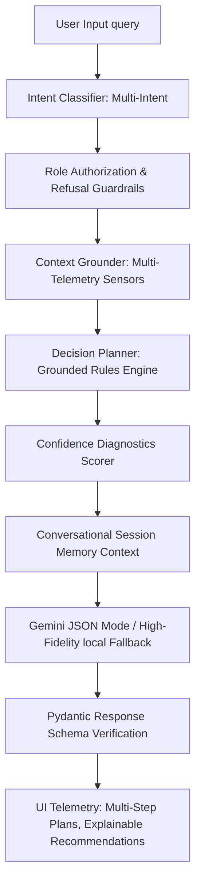

# MatchOps AI — The Intelligent Operations Copilot for FIFA World Cup 2026

**MatchOps AI** is a production-oriented, GenAI-enabled stadium operations copilot designed for MetLife Stadium during the FIFA World Cup 2026. The platform provides customized dashboards and specialized workflows for four primary stakeholder roles: **Fans**, **Volunteers**, **Security/Venue Staff**, and **Organizers**.

Unlike standard chatbots or generic dashboards, MatchOps AI coordinates a multi-stage AI reasoning orchestrator to analyze user queries, build grounded context, apply stadium safety and routing rules, and render structured recommendations alongside explanation logs.

---

## 🏗️ Architecture & AI Decision Flow

MatchOps AI acts as a **GenAI Decision Support System**. Every query is processed through a structured operations pipeline that guarantees data groundings, role boundaries, explainability diagnostics, and session history state tracking.

### Reasoning Pipeline



1. **Multi-Intent Classifier**: Classifies queries into 12 detailed intents (Navigation, Accessibility, Crowd Intelligence, Crowd Risk, Incident Reporting, Emergency Response, Transport Planning, Volunteer Allocation, Organizer Summary, Sustainability, Lost & Found, and General Information). Supports multi-intent query groupings.
2. **Role Authorization & Refusal Guardrails**: Enforces role access keys (Fan, Volunteer, Security, Organizer). If a query exceeds role clearance, it intercepts the query, returns a polite explanation, and lists permitted actions.
3. **Context Grounder**: Assembles raw sensor telemetry (matches, queue waits, restrooms, transit delays, sustainability offsets, and staff shifts).
4. **Decision Planner**: Applies operational rules (turnstile detours, concourse medical bypasses, accessibility ramp lots).
5. **Confidence Scorer**: Calculates a numerical index (0.0 to 1.0) and records specific database checklist omissions to prevent false certainty.
6. **Session Memory**: Ingests up to 4 historical message pairs per `session_id` to support follow-up questions.
7. **Structured Output Mode**: Restricts Gemini generation to structured Pydantic models verifying detail parameters, assumptions, checklists, and optional multi-step chronological plans.

---

## 🌟 Application Features

1. **Smart Navigation**: Directs fans to Gate C/B based on live queues, estimating walking time, and providing wheelchair-accessible options.
2. **Crowd Intelligence**: Provides a live heatmap overlay representing occupancy at Gate entrances, concessions, and restroom sectors.
3. **Accessibility Planner**: Features text size adjusting, high-contrast dark theme rendering, and dimming inaccessible routes (e.g. steps/elevators mapping).
4. **Transport Copilot**: Tracks Metro departures, shuttle frequencies, rideshare wait times, and recommend parking lots based on fill rates.
5. **Sustainability Insights**: Displays resource widgets tracking water usage, energy offset generated from solar panels, and landfill diversion stats.
6. **Multilingual AI**: Localizes both the UI widgets and the AI Copilot reasoning summaries into English, Spanish, French, Arabic, and Portuguese.
7. **Incident Decision Support**: Enables volunteers and security to dispatch active incidents, automatically updating routes on spectator maps, and suggesting reallocations.

---

## 📂 Project Structure

```
matchops-ai/
├── backend/
│   ├── ai/
│   │   └── orchestrator.py    # Multi-stage AI Orchestrator & system prompting
│   ├── api/
│   ├── utils/
│   │   └── database.py        # In-memory simulator database (FIFA 2026 telemetry)
│   ├── models.py              # Pydantic schemas (Incident, AIResponse, etc.)
│   ├── main.py                # FastAPI endpoints, static file mounting, CORS
│   └── tests/
│       └── test_orchestrator.py
├── frontend/
│   ├── src/
│   │   ├── components/
│   │   │   ├── StadiumMap.tsx     # SVG Stadium Map with heatmaps and beacons
│   │   │   └── CopilotPanel.tsx   # Chat console & AI reasoning pipeline steps
│   │   ├── pages/
│   │   │   ├── LandingPage.tsx    # Role Selector & Language configurator
│   │   │   └── Dashboard.tsx      # Fan, Volunteer, Security, and Organizer UIs
│   │   ├── types/
│   │   │   └── index.ts           # Shared TypeScript models
│   │   ├── App.tsx                # App state, theme toggles, and page routing
│   │   ├── index.css              # Glassmorphism, animations, and CSS custom tokens
│   │   └── main.tsx
│   ├── index.html
│   └── package.json
└── README.md
```

---

## 🚀 Setup & Installation

### Prerequisite Checklist
- Node.js (v18 or higher)
- Python (3.9 or higher)

### 1. Set up Backend (FastAPI)
1. Navigate to the root directory.
2. (Optional) Create and activate a python virtual environment:
   ```bash
   py -m venv venv
   .\venv\Scripts\activate
   ```
3. Install dependencies from requirements.txt:
   ```bash
   pip install -r requirements.txt
   ```
4. Define your Gemini API key (Optional):
   ```powershell
   $env:GEMINI_API_KEY="your-api-key-here"
   ```
   *Note: If no API key is provided, the backend automatically activates a high-fidelity local reasoning engine matching the exact output specifications for standard operations.*

### 2. Start the Backend Server
Run Uvicorn from the root workspace directory:
```bash
py -m uvicorn backend.main:app --reload --port 8000
```
FastAPI docs will be available at: http://localhost:8000/docs

Verify the operational health check route at http://localhost:8000/api/health. It outputs the following JSON response:
```json
{
  "status": "ok",
  "version": "RC3",
  "simulation": true,
  "gemini_available": true,
  "fallback_available": true,
  "timestamp": "ISO8601_TIMESTAMP"
}
```

---

### 3. Set up Frontend (React, TS, Vite)
1. Open a new terminal session and navigate to the `frontend` folder:
   ```bash
   cd frontend
   ```
2. Install npm modules:
   ```bash
   npm install
   ```
3. Run the Vite development server:
   ```bash
   npm run dev
   ```
4. Access the web dashboard at: http://localhost:5173

---

## ⚙️ Live Simulation Engine & Demo Mode

MatchOps AI includes a deterministic operations simulator that models MetLife Stadium progression. 

- **Automatic Telemetry Syncing**: A background event loop ticks every 5 seconds, introducing subtle, realistic fluctuations in queue wait times, water meters, and solar grids.
- **Scenario Overrides**: Operators can instantly override stadium conditions using the **Live Demo Mode** toolbar:
  - *Pre-Match / Entry Rush / Kickoff / Halftime / 2nd Half / Full Time / Exit Rush / Closed*
  - *Emergency Scenario* (triggers medical and smoke hazards)
  - *Heavy Crowd* (spikes gate queues to peak congestion)
  - *Transport Delay* (introduces 25-minute rail delays and rideshare surges)
  - *Accessibility Surge* (increases wheelchair priority boarding queue loads)

---

## 🛠️ Verification & Test Suite

### Running Backend Unit Tests
The test suite validates intent classifications, permissions, session memories, kpi score adjustments, and simulation phase shifts:
```bash
py -m unittest backend/tests/test_orchestrator.py
```

### Manual Validation Sequence
1. Access the landing page and select the **Organizer** role (`ORG-2026`).
2. Observe the **Organizer Executive KPIs** (Operational Health, Accessibility, Volunteers, Transport, Flow, Sustainability, Incidents) showing dynamic trend indicators and AI explanation summaries.
3. Switch scenario tabs in the **Live Demo Mode Scenarios** card (e.g. to **Halftime**). Notice concession wait times immediately spike to 45 mins.
4. Go to **🚇 Transit Delay** scenario. Confirm the transport reliability indicator drops, a warning displays metro delays of 25m, and a proactive scrolling alert banner pops up at the top.
5. In the **Global Search Bar** at the top of the header, type `"Gate A"` or `"Block 114"`. Observe the concessions tables, restroom slots, active incidents panel, and operations logs filter dynamically.
6. Trigger the **🚨 Emergency** scenario. Observe the active incident dispatcher trigger flashing red beacons on Block 114 and Concourse 220, updating the SVG stadium map instantly.
7. Click **Exit Session** in the sidebar. Confirm that client session storage keys are removed and the backend context memory resets cleanly.

---

## 🔐 Environment Variables

| Variable | Description | Required | Default / Behavior |
| --- | --- | --- | --- |
| `GEMINI_API_KEY` | Google Gemini API Key | Optional | If missing, system triggers high-fidelity local fallback operations engine |
| `PORT` | Backend application port | Optional | Defaults to `8000` |

---

## 🌐 Production Deployment Guide

### Backend & Frontend Combined (Vite Build + FastAPI Static Serves)
1. Build the production React assets inside the `frontend` folder:
   ```bash
   cd frontend
   npm install
   npm run build
   ```
   *Vite outputs HTML/JS assets to `frontend/dist`.*
2. Start the FastAPI server:
   ```bash
   cd ..
   py -m uvicorn backend.main:app --port 8000
   ```
   *FastAPI automatically mounts and serves files in `frontend/dist` at the root path (`/`). Access the entire production application at http://localhost:8000.*

---

## 🔮 Future Roadmap

1. **Active LLM Guardrails Integration**: Incorporate Google's Cloud Armor and LLM security filters at the API gateway layer to prevent jailbreaks.
2. **Predictive Simulation Analytics**: Build ARIMA/LSTM time-series models to anticipate gate congestion 30 minutes before arrival.
3. **Multi-Stadium Coordination**: Extend data schema to support simultaneous simulation metrics across MetLife, Azteca, and BC Place stadiums.

